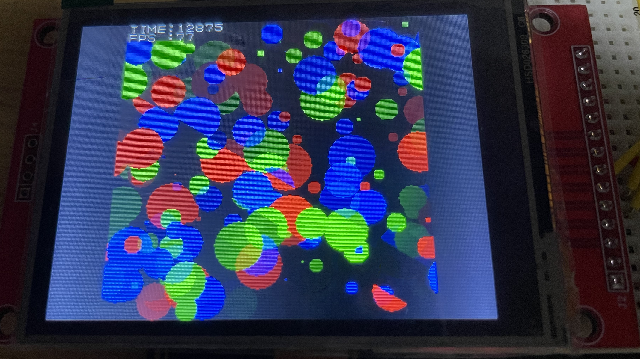

# RP2040_PIO_GFX
### 概要
趣味と勉強のために作成しているArduino用グラフィックライブラリです  <br/>
Raspberry Pi Pico(rp2040)に搭載されているProgrammable I/OとDMAを利用するためCPUを占有しないのが特徴です  <br/>
実用性はあまりないですが、どなたかの参考になれば幸いです  <br/>
<br/>

### 注意事項
- 本ライブラリはRaspberry Pi Pico(rp2040)専用です
- LCDの定格を超えた周波数で信号を送っており、破損の恐れがあります
- 開発中（遊び中）のため、破壊的変更が発生する可能性があります

### 対応ドライバ
- ILI9341

### 機能
- [x] 全画面クリア
- [x] ダブルバッファ（描画サイズはメモリ次第）
- [x] 描画完了フラグの確認
- [x] 描画完了後のコールバック呼び出し
- [x] 1点描画
- [x] 直線描画
- [x] 円描画
- [ ] 矩形描画
- [x] 文字描画(8pix 0-9 A-Z)
- [ ] 文字描画（ttf形式対応）
- [ ] 文字描画（u8g2形式対応）
- [ ] ILI9341搭載のタッチパネル
<br />

### 利用例

- 240 x 240 の画面サイズで毎ループ全画面描画
- R G B 各色の円をそれぞれ33個描画
- 70fpsぐらいで描画
<br/>

```
#include <Arduino.h>
#include <RP2040_PIO_GFX.h>

// ピンアサイン
#define TFT_MOSI 19
#define TFT_CLK 18
#define TFT_DC 22
#define TFT_RST 26
#define TFT_CS 27
// 解像度
#define WIDTH 240
#define HEIGHT 240
// 描画クラス
RP2040_PIO_GFX::Gfx gfx;


void setup() {
  // LCD初期化
  gfx.initILI9341(
    TFT_CLK,
    TFT_MOSI,
    TFT_DC,
    TFT_RST,
    TFT_CS,
    40,
    0,
    WIDTH,
    HEIGHT,
    2,
    1.0);

  // ダブルバッファ用のメモリ生成
  // メモリサイズはLCD初期化の際の画面サイズと同じ
  gfx.initDoubleBuffer();

  // DMAによる画像メモリ転送を有効化
  gfx.initDMA();

  // LED点灯
  pinMode(25, OUTPUT);
  digitalWrite(25, HIGH);
}


unsigned long ts = 0, te = 0;
char _buf[12];

void loop() {
  // DMA転送が完了したら処理実行
  if(gfx.isCompletedTransfer()){
    // 描画指示
    gfx.swap();

    // 全画面クリア
    gfx.clear(gfx.BLACK);

    // 図形描画
    for(int i = 0; i < 33; i++){
      gfx.drawCircle(random(240), random(240), random(20), gfx.RED);
      gfx.drawCircle(random(240), random(240), random(20), gfx.BLUE);
      gfx.drawCircle(random(240), random(240), random(20), gfx.GREEN);
    }

    // 時間計測、および文字出力
    te = micros();
    unsigned long _time = te - ts;
    unsigned long _fps = 1'000'000 / _time;
    snprintf(_buf, 12, "%d", _time);
    gfx.writeFont8(0, 0, "TIME:");
    gfx.writeFont8(5, 0, _buf);
    snprintf(_buf, 12, "%d", _fps);
    gfx.writeFont8(0, 1, "FPS :");
    gfx.writeFont8(5, 1, _buf);
    ts = micros();
  }
}
```


  
